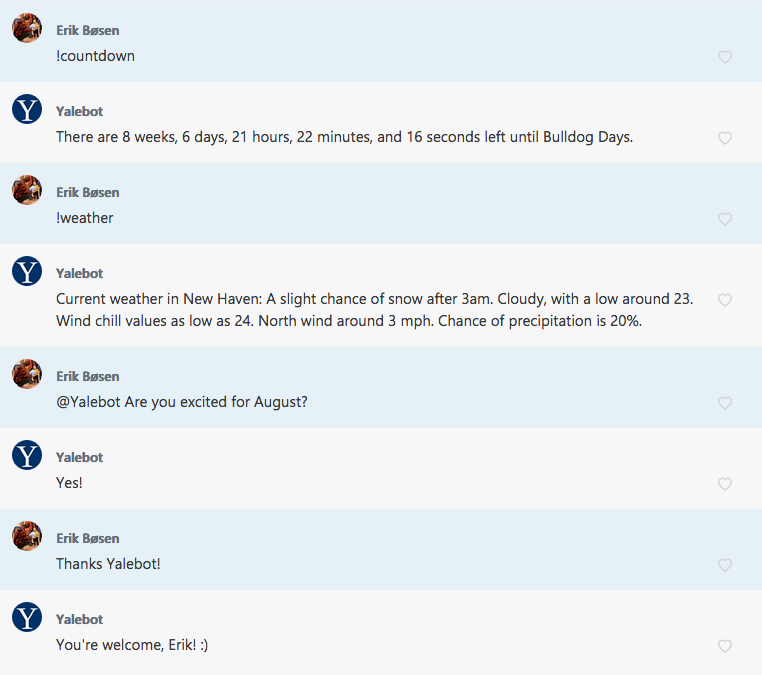

# Columbot
[](https://travis-ci.org/ErikBoesen/Yalebot)

> A GroupMe chatbot for the Columbia Class of 2023 group.



## Motivation
N/A

## Design
Columbot uses the [GroupMe Bots API](https://dev.groupme.com/tutorials/bots) for basic message exchanging, hosting a Flask server which listens for incoming webhooks then decides on a response.

In order to keep its code clean and maintainable, most of Columbot's functions are compartmentalized under the subdirectory `modules/`. Each contains a class which is referenced in `bot.py` and implements a method `response` taking as parameters the query (message text following command invocation) and raw message dictionary from GroupMe. These modules inherit from the `Module` class, and a `DESCRIPTION` class variable should be assigned, primarily for `!help` pages. Each module must be instantiated in `bot.py`. Note that meme generation commands have their own dictionary for flexibility in the event of a change to their parameter structure. Simple commands (those which need no logical processing to generate a response and give a static response every time) are present in their own dictionary as well.

## Platform
Columbot runs best on [Heroku](https://heroku.com).

To run Columbot, you must provide your own API key for certain modules to function properly:

```sh
heroku config:set GROUPME_ACCESS_TOKEN=abcdef12345  # obtained from dev.groupme.com
```

After that, simply push the code via Heroku CLI and the bot will launch.

## Authorship
Columbot is maintained by [Dominic Coletti](https://github.com/dominiccoletti). Credit goes to [Erik Boesen](https://github.com/ErikBoesen) for Columbot, a modified version of Yalebot.

## License
[GPL](LICENSE)
